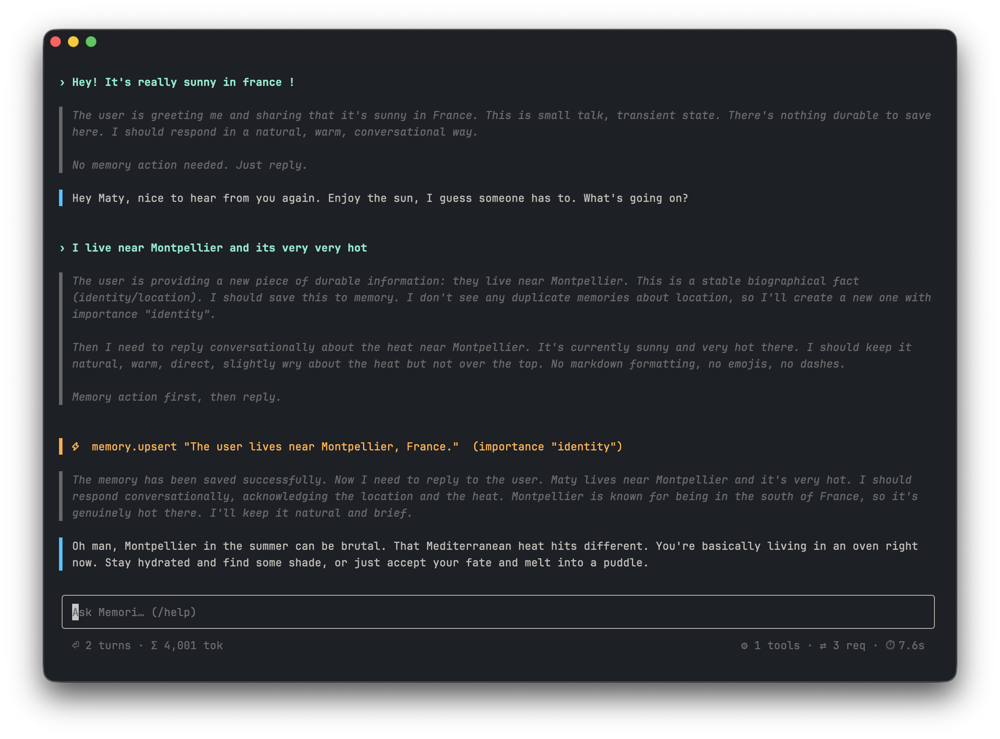

<div align="center">

# Memori

**A prototype long-term memory layer for LLM conversations.**

Memori lets an assistant remember preferences, facts, and past chats across fresh-context sessions, with automatic retrieval, LLM-controlled write hygiene, and end-of-session summarization.

[](https://www.python.org/)
[](https://github.com/astral-sh/uv)
[](https://openrouter.ai/)
[](https://github.com/Textualize/textual)
[](https://www.trychroma.com/)
[](https://ai.pydantic.dev/)
[](https://github.com/astral-sh/ruff)
[](http://mypy-lang.org/)
[]()

</div>

---



## How it works

1. **Retrieve.** Before each model call, the system pulls top-ranked memories plus recent and similar past conversation summaries, then injects them into context. The default `.env.example` asks for 10 recent and 10 similar summaries.
2. **Answer + curate.** The LLM responds, and uses two tools, `memory_upsert` and `memory_delete`, to keep long-term memory accurate: creating new memories, refining contradicted ones, pruning duplicates, and honoring forget requests.
3. **Summarize.** When a session ends, the system stores a one-sentence summary that later feeds the recent / similar context for future sessions.

Ranking blends semantic similarity, importance category (identity > global preference > active project > useful fact > uncertain), recency, and usage, with a small boost for globally-scoped memories.

## Quick start

**Requirements:** Python 3.10, [`uv`](https://github.com/astral-sh/uv), and a `.env` at the repo root.

```sh
make env       # create .venv and install deps (app + dev)
make run       # start the interactive CLI
```

### `.env`

Copy [`.env.example`](../.env.example) to `.env` and fill in the OpenRouter key. These are the model settings:

```ini
OPENROUTER_API_KEY=sk-or-v1-...
MEMORI_LLM_MODEL=deepseek/deepseek-v4-flash
MEMORI_REASONING_EFFORT=high
MEMORI_EMBEDDING_MODEL=perplexity/pplx-embed-v1-4b
```

The remaining values in `.env.example` are also read at runtime. They cover retrieval limits (`MEMORI_RETRIEVAL_TOP_K`, `MEMORI_RECENT_CONVERSATIONS`, ...), importance weights per category, and ranking-formula weights (semantic / importance / recency / usage / global-scope boost).

## Using the CLI

Type to chat. Reasoning streams in dim italic, the reply streams in plain, and tool calls show as highlighted lines like `memory.upsert`. Type `/` to open command suggestions. `Tab` and arrow keys navigate, `Enter` selects.

| Command     | What it does                                          |
| ----------- | ----------------------------------------------------- |
| `/new`      | Save the current session as a summary and start fresh |
| `/clear`    | Alias for `/new`                                      |
| `/reset`    | Wipe all stored memories                              |
| `/memories` | List every stored memory                              |
| `/help`     | Show help                                             |
| `/quit`     | Save the current session as a summary and exit        |

## Benchmarks

15 YAML scenarios in [`benchmarks/`](../benchmarks) cover retrieval injection, memory tool calls (create / update / delete / noise rejection), importance reranking, and full multi-session loops.

```sh
make benchmark
```

A timestamped markdown log lands in `runs/` (gitignored).

## Layout

```
src/memori/
  cli/         user-facing REPL (entry + Textual TUI)
  domain/      memory model and engine
  infra/       env, OpenRouter client, vector store (Chroma)
  llm/         chat loop, prompts, tools, summarization
  benchmark/   scenario loader, runner, assertions, schema
benchmarks/    scenario YAML files
runs/          benchmark run logs (gitignored)
```

## Development

All tooling is driven through the Makefile so caches, paths, and flags stay consistent.

| Target           | Description                                                   |
| ---------------- | ------------------------------------------------------------- |
| `make env`       | Create `.venv` and install `app` + `dev` dependency groups    |
| `make clean`     | Remove `.venv`                                                |
| `make run`       | Alias for `make cli`                                          |
| `make cli`       | Start the interactive CLI                                     |
| `make benchmark` | Run YAML scenarios in `benchmarks/`, writing a log to `runs/` |
| `make tidy`      | `mypy`, `ruff check --fix`, `ruff format`, `prettier --write` |
